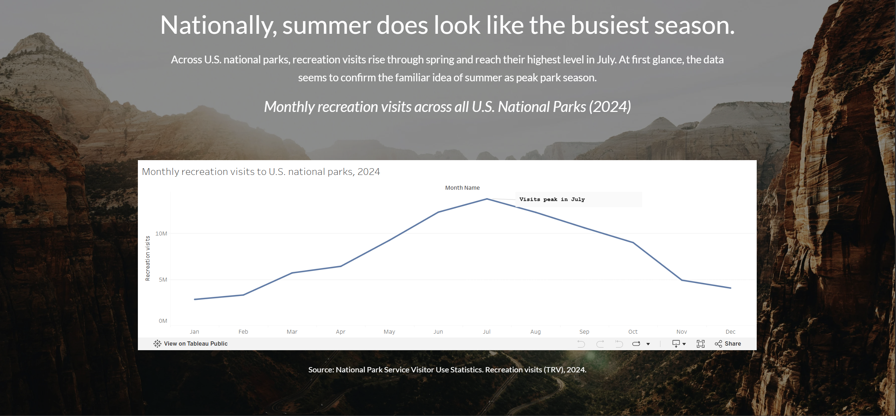
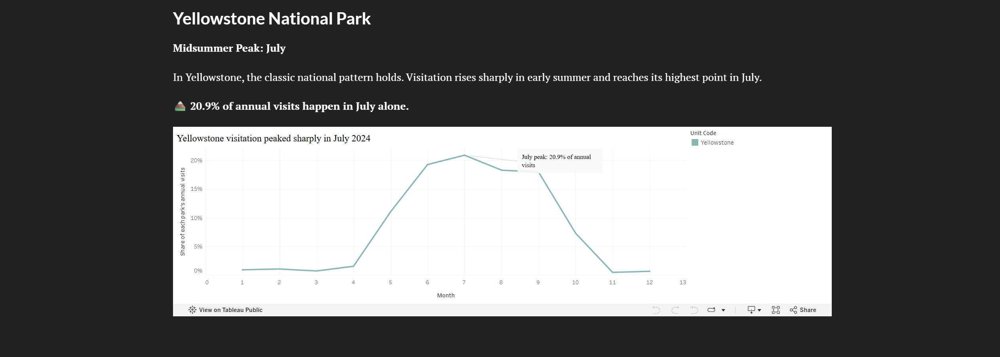
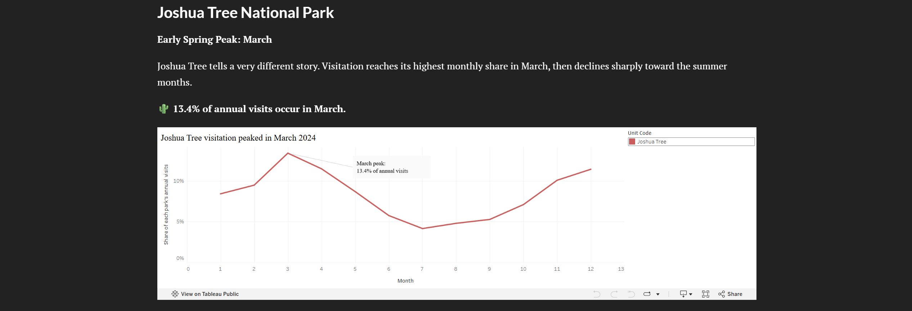
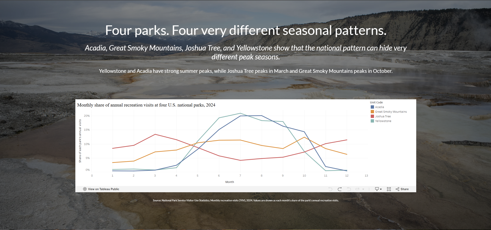

| [home page](https://pddpdd20020105.github.io/tswd-portfolio/) | [data viz examples](https://pddpdd20020105.github.io/tswd-portfolio/dataviz-examples) | [critique by design](https://pddpdd20020105.github.io/tswd-portfolio/critique-by-design) | [MakeoverMonday](https://pddpdd20020105.github.io/tswd-portfolio/makeover-monday) | [final project I](https://pddpdd20020105.github.io/tswd-portfolio/final-project-part-one) | [final project II](https://pddpdd20020105.github.io/tswd-portfolio/final-project-part-two) | [final project III](https://pddpdd20020105.github.io/tswd-portfolio/final-project-part-three) |

# Final Project Part II: Summer Isn't Peak Season Everywhere

In Part I, I developed the initial concept and story structure for a project about seasonal visitation patterns at U.S. national parks. For Part II, I developed that outline into a working Shorthand story, created higher-fidelity data visualizations, and conducted user research to evaluate whether the narrative and visualizations were clear to potential readers.

As I continued developing the project, I refined the story around a clearer argument: although U.S. national park visitation peaks in summer overall, the national pattern does not represent every individual park. Different parks can have very different seasonal peaks, so park-specific visitation patterns can provide travelers with more useful context than the national pattern alone.

[View the current Shorthand story](https://carnegiemellon.shorthandstories.com/when-do-people-visit-americas-national-parks/index.html)

# Wireframes / Storyboards

For Part II, I developed the storyboard directly in Shorthand rather than creating a separate static wireframe. The current prototype uses a scrolling narrative that begins with the familiar assumption that summer is peak season, establishes why that assumption appears reasonable at the national level, and then challenges it with park-level data.

The story currently follows this progression:

1. **Opening claim:** Summer isn't peak season everywhere.
2. **Setup:** Summer seems like the obvious peak season for national parks.
3. **National context:** Monthly recreation visits across U.S. national parks rise through spring and reach their highest level in July.
4. **Turning point:** The national pattern does not tell the whole story when individual parks are examined.
5. **Individual examples:** Yellowstone follows the national pattern and peaks in July, while Joshua Tree peaks much earlier in March.
6. **Key takeaway:** Peak visitation depends on the park.
7. **Broader comparison:** Acadia, Great Smoky Mountains, Joshua Tree, and Yellowstone show different seasonal patterns.
8. **Individual exploration:** Readers can explore park-level visitation patterns rather than relying only on the national pattern.
9. **Conclusion:** There is no single peak season that describes every national park. Historical visitation can provide useful context for trip planning, but it does not by itself measure weather, road access, or crowding at specific locations.

### Current Shorthand Prototype

The screenshots below show several key stages of the current high-fidelity Shorthand prototype.

**Opening and story setup**

**National visitation pattern**

**Yellowstone: a midsummer peak**

**Joshua Tree: an early spring peak**

**Four-park comparison**

[View the full interactive Shorthand story](https://carnegiemellon.shorthandstories.com/when-do-people-visit-americas-national-parks/index.html)

The Shorthand prototype allows me to test the pacing of the story, the transition from the national pattern to park-level evidence, and how the visualizations work together as part of a narrative rather than as isolated charts.

## Draft Data Visualizations

The current Shorthand story uses several Tableau visualizations to move from the national pattern to increasingly specific park-level evidence.

### National monthly visitation

The first visualization shows monthly recreation visits across U.S. national parks in 2024. It establishes the national pattern: recreation visits rise through spring and reach their highest level in July. This provides the initial evidence for the familiar assumption that summer is peak season for national parks overall.

The chart includes a descriptive title, month and visitation axes, an annotation identifying the July peak, and a data source note.

**Source:** National Park Service Visitor Use Statistics, recreation visits (TRV), 2024.

### Yellowstone monthly visitation

The Yellowstone visualization provides an example of a park that closely follows the national pattern. Yellowstone's monthly share of annual visitation rises sharply in early summer and reaches its highest point in July.

In 2024, **20.9% of Yellowstone's annual recreation visits occurred in July alone**. Highlighting this value helps readers quickly identify the park's strong midsummer peak.

**Source:** National Park Service Visitor Use Statistics, recreation visits (TRV), 2024.

### Joshua Tree monthly visitation

Joshua Tree provides a contrasting example. Its visitation pattern does not follow the national summer peak. Instead, its highest monthly share of annual recreation visits occurs in March and then declines toward the summer months.

In 2024, **13.4% of Joshua Tree's annual recreation visits occurred in March**. Placing this chart after Yellowstone creates a direct contrast between two different seasonal visitation patterns.

**Source:** National Park Service Visitor Use Statistics, recreation visits (TRV), 2024.

### Four-park seasonal comparison

The broader comparison includes Acadia, Great Smoky Mountains, Joshua Tree, and Yellowstone. Instead of comparing raw visitor totals, I use each month's share of a park's annual recreation visits. This makes it easier to compare the shapes of the seasonal patterns even though the parks have very different total visitation levels.

The comparison shows that Yellowstone and Acadia have strong summer peaks, Joshua Tree peaks in March, and Great Smoky Mountains reaches its highest monthly share in October. Together, these examples show why the national summer peak does not describe every individual park.

**Source:** National Park Service Visitor Use Statistics, recreation visits (TRV), 2024.

# User Research

## Target Audience and Recruitment Approach

My primary audience is people who are interested in visiting U.S. national parks and may use historical visitation patterns as one piece of information when deciding when to travel.

For user research, I asked three MISM-BIDA 16-month students to review the Shorthand prototype and complete a short feedback survey. They can reasonably represent potential readers of a travel-oriented data story. I did not collect names or other personally identifiable information.

Participants first viewed the Shorthand prototype and then completed a short Google Form. The survey focused on whether the main message was clear, whether the narrative progression was easy to follow, whether the visualizations were understandable, and whether the planned individual-park interaction would be useful.

## Research Goals and Interview Script

The main goal of the research was to determine whether readers understood the intended narrative: national park visitation may peak in summer overall, but individual parks can have very different seasonal patterns. I also wanted to identify parts of the story or visualizations that needed additional explanation.

| Goal | Questions to Ask |
|------|------------------|
| Evaluate the clarity of the overall narrative | How clear is the main message of the story? |
| Evaluate the story structure | Is the transition from the national trend to individual parks easy to follow? |
| Evaluate visualization readability | How easy are the data visualizations to understand? |
| Evaluate the planned interaction | Do you think an interactive individual-park selector would be useful? |
| Check whether readers understand the intended conclusion | What do you think the main takeaway of the story is? |
| Identify opportunities for improvement | What is one suggestion you have for improving the story? |

# Interview Findings

## Participant 1

**Background:** MISM-BIDA 16-month student.

The participant found the main message **very clear**, the transition from the national trend to individual parks **very easy to follow**, and the visualizations **very easy to understand**. They also thought the planned interactive park selector would be **very useful**.

Their interpretation of the main takeaway closely matched the intended narrative: although national park visitation generally peaks during the summer, individual parks can have very different seasonal patterns. They suggested adding the interactive park selector so readers can investigate parks they are personally interested in. They also suggested briefly providing context for why different parks may peak in different seasons, such as weather, road accessibility, or seasonal attractions.

A key observation from this participant was:

> "Looking at each park separately gives visitors a much better idea of when it is actually busiest."

## Participant 2

**Background:** MISM-BIDA 16-month student.

The participant found the main message **very clear**, the transition from the national trend to individual parks **very easy to follow**, and the visualizations **very easy to understand**. They also considered the planned interactive park selector **very useful**.

Their interpretation of the story was consistent with the intended takeaway. They understood that there is no single peak season for all U.S. national parks and recognized that Yellowstone and Acadia peak in summer, while Joshua Tree and Great Smoky Mountains follow different seasonal patterns.

Their main suggestion was to complete the interactive park selector mentioned near the end of the story. They felt that allowing readers to explore a park they are personally interested in would make the story feel more complete.

A key observation from this participant was:

> "There is no single 'peak season' for all U.S. national parks."

## Participant 3

**Background:** MISM-BIDA 16-month student.

The third participant had a more mixed response. They found the main message **somewhat clear** and the transition from the national trend to individual parks **mostly easy to follow**, but rated the visualizations **neutral** in terms of ease of understanding. They considered the planned interactive park selector **somewhat useful**.

They still understood the central takeaway that visitation patterns are seasonal and that the busiest months vary depending on the park. Their main suggestion was to provide more guidance around the visualizations because some charts contain a lot of information at once.

They recommended adding short explanations, annotations, or highlighted data points so readers can identify the most important patterns more quickly.

A key observation from this participant was:

> "A brief annotation or highlighted data point could make the key pattern easier to understand quickly."

## Research Synthesis

Overall, all three participants understood the central message that national park visitation is seasonal but that individual parks can have different peak periods. Participants 1 and 2 found the narrative and visualizations very easy to follow, while Participant 3 understood the story but found the visualizations less immediately clear.

Two participants emphasized that an individual-park exploration would make the story more useful by allowing readers to examine parks they are personally interested in. Participant 3 also identified a need for clearer visual guidance, including annotations and highlighted data points.

Based on this feedback, I refined the Shorthand story after the initial user research. I strengthened the framing around the contrast between the national pattern and individual parks, added more explicit park-level examples, and used Yellowstone and Joshua Tree as contrasting cases. I also added clearer annotations and explanatory text around the visualizations so readers can identify the important peaks more quickly.

These revisions shifted the story from primarily asking when people visit national parks toward making a clearer argument: **the national summer peak can hide important differences in the seasonal visitation patterns of individual parks.**

# Revisions and Next Steps

| Research synthesis | Revisions / next steps |
|--------------------|------------------------|
| All three participants understood that different parks can have different seasonal visitation patterns. | Preserve the national-to-park-level narrative while making the central argument more explicit. |
| Participants 1 and 2 considered individual-park exploration useful. | Include an individual-park exploration so readers can examine park-level patterns rather than relying only on the national trend. |
| Participant 3 found the visualizations less immediately clear and requested more guidance. | Add clearer annotations, highlighted peak values, and explanatory text around the visualizations. |
| Participant 1 suggested explaining why seasonal patterns may differ between parks. | Avoid making unsupported causal claims from visitation data alone. Additional explanations about weather, access, or seasonal conditions should only be included when supported by appropriate sources. |

The user research helped clarify both the strengths and limitations of the initial prototype. The revised story retains the national-to-individual structure but makes the central argument more explicit and gives readers more guidance for interpreting the visualizations.

The project does not attempt to identify a universal "best" time to visit a national park. Visitation data shows when recorded recreation visits are higher or lower, but it does not by itself measure weather, road access, or crowding at specific locations. The final story therefore presents historical visitation patterns as one source of information rather than a complete travel recommendation.

## References

- National Park Service. *NPS Visitor Use Statistics Data Package, 2025*. https://catalog.data.gov/dataset/nps-visitor-use-statistics-data-package-2025
- National Park Service. *NPS Visitor Use Statistics Definitions*. https://www.nps.gov/subjects/socialscience/nps-visitor-use-statistics-definitions.htm

## AI Acknowledgements

I used ChatGPT, Google Gemini, and Copilot to assist with wording, user research materials, and technical troubleshooting. All AI-generated suggestions were reviewed and edited by me, and I made the final decisions on the content, analysis, visualizations, and design.
