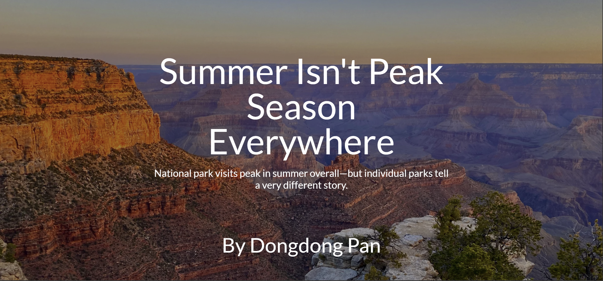
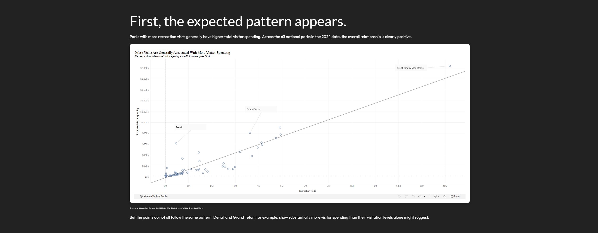
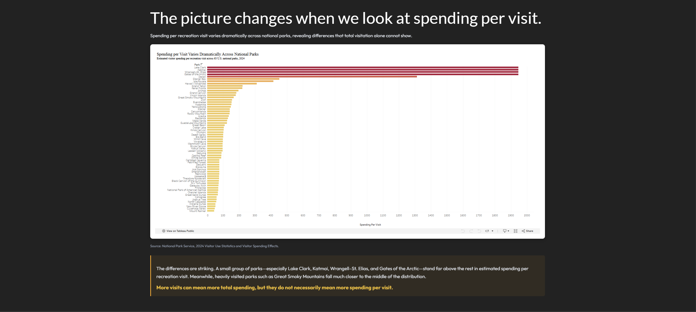
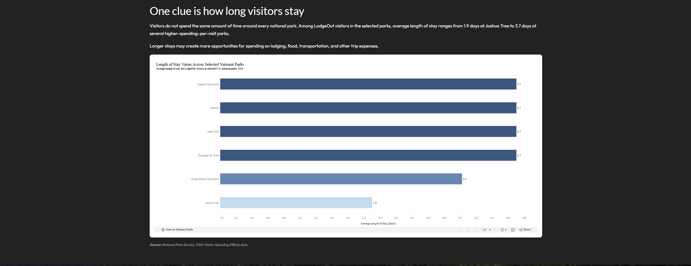
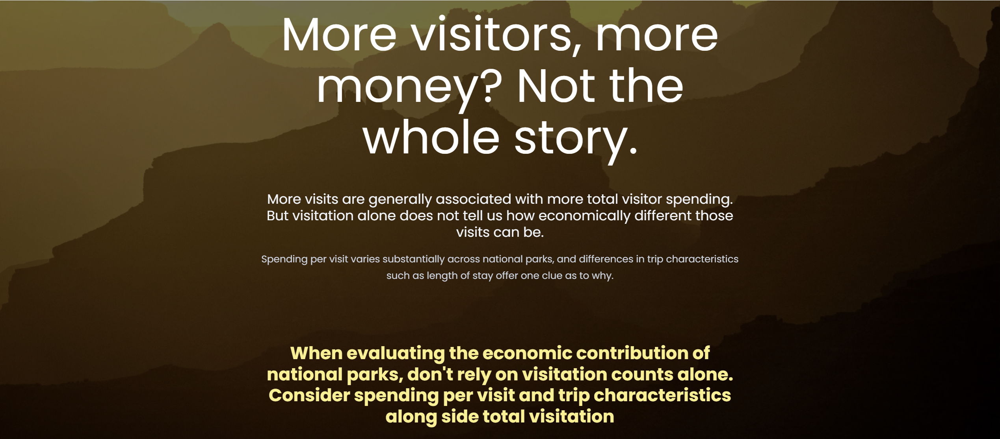

| [home page](https://pddpdd20020105.github.io/tswd-portfolio/) | [data viz examples](https://pddpdd20020105.github.io/tswd-portfolio/dataviz-examples) | [critique by design](https://pddpdd20020105.github.io/tswd-portfolio/critique-by-design) | [MakeoverMonday](https://pddpdd20020105.github.io/tswd-portfolio/makeover-monday) | [final project I](https://pddpdd20020105.github.io/tswd-portfolio/final-project-part-one) | [final project II](https://pddpdd20020105.github.io/tswd-portfolio/final-project-part-two) | [final project III](https://pddpdd20020105.github.io/tswd-portfolio/final-project-part-three) |

# Final Project Part II: More Visitors, More Money?

In Part I, I developed the initial concept for a data story examining the relationship between national park visitation and visitor spending. The project begins with an intuitive expectation: parks with more recreation visits should generally be associated with more total visitor spending. However, looking only at total visitation can hide substantial differences in how much visitor spending is associated with each recreation visit.

For Part II, I developed the initial outline and sketches into a working Shorthand story, created higher-fidelity Tableau visualizations, and conducted user research with three potential readers. The purpose of this stage was to test whether the argument was understandable, whether the transition from total visitor spending to spending per recreation visit was convincing, and whether the visualizations supported the narrative.

[View the current Shorthand story](https://carnegiemellon.shorthandstories.com/more-visitors-more-money/index.html)

# Wireframes / Storyboards

The Part II prototype develops the wireframe from Part I into a scrolling Shorthand story. The narrative is structured around moving the reader from an intuitive expectation to a more complicated interpretation of national park visitation and visitor spending.

The story currently follows this progression:

1. **Opening question — More visitors, more money?**  
   Introduce the assumption that heavily visited national parks should also be associated with more visitor spending.

2. **Expectation — More visits are associated with more total spending.**  
   A scatter plot compares 2024 recreation visits with estimated visitor spending across national parks and establishes the overall positive relationship.

3. **Complication — Total spending is only part of the story.**  
   The story introduces spending per recreation visit as another way to compare parks with very different visitation levels.

4. **Surprise — The picture changes on a per-visit basis.**  
   A park-level comparison shows substantial variation in estimated spending per recreation visit, including several relatively low-visitation parks with very high values.

5. **Exploration — What might help explain the difference?**  
   The story looks more closely at length of stay for selected parks as one possible clue. Longer stays may create more opportunities for spending on lodging, food, transportation, and other trip expenses.

6. **Takeaway — Visitor counts are only part of the story.**  
   More recreation visits are generally associated with more total visitor spending, but visitation alone does not capture how economically different those visits may be.

## Current Shorthand Prototype

The current prototype uses Shorthand to connect the visualizations through a scrolling narrative. Rather than presenting the Tableau charts as independent graphics, each visualization answers a question created by the previous section.

### Opening and story setup

### Visits and total visitor spending

### Spending per recreation visit

### Exploring length of stay

### Final takeaway

[View the full interactive Shorthand story](https://carnegiemellon.shorthandstories.com/more-visitors-more-money/index.html)

The Shorthand prototype allows me to test the pacing of the argument and whether each visualization provides enough evidence for the next step in the story. The current design intentionally moves from the familiar measure of visitation, to total spending, to spending per visit, and finally to one trip characteristic that may provide context for the differences between parks.

# Draft Data Visualizations

For Part II, I developed the exploratory Tableau sketches from Part I into higher-fidelity draft visualizations. The charts use real 2024 National Park Service data and include more deliberate titles, labels, annotations, and visual emphasis.

## Recreation Visits vs. Visitor Spending

The first visualization compares recreation visits with estimated visitor spending across U.S. national parks in 2024.

The overall pattern is positive: parks receiving more recreation visits generally also have more total visitor spending. This supports the intuitive expectation introduced at the beginning of the story. At the same time, individual parks do not fall perfectly along the same pattern. Parks such as Denali and Grand Teton show that parks with similar levels of visitation can be associated with different levels of visitor spending.

This visualization establishes the baseline relationship before the story changes perspective from total spending to spending per recreation visit.

[View the interactive Tableau visualization](https://public.tableau.com/views/PartIIHigh-FidelityDraftRecreationVisitsvs_VisitorSpending/P2VisitsvsSpending?:showVizHome=no)

**Source:** National Park Service, 2024 Visitor Use Statistics and Visitor Spending Effects.

## Spending per Recreation Visit

The second visualization divides estimated visitor spending by recreation visits:

**Spending per recreation visit = Estimated visitor spending / Recreation visits**

This comparison reveals substantial variation between national parks. Several parks, including Lake Clark, Katmai, Wrangell–St. Elias, and Gates of the Arctic, stand far above much of the distribution in estimated spending per recreation visit. Meanwhile, some heavily visited parks fall much closer to the middle of the distribution.

The purpose of this visualization is not to claim that parks with higher spending per visit are more valuable. Instead, it demonstrates that total visitation alone does not describe the differences in visitor spending associated with different park trips.

[View the interactive Tableau visualization](https://public.tableau.com/views/PartIIHigh-FidelityDraftNationalParkVisitationandVisitorSpending/P2SpendingperVisit?:showVizHome=no)

**Source:** National Park Service, 2024 Visitor Use Statistics and Visitor Spending Effects.

## Length of Stay at Selected National Parks

The third visualization explores one possible clue behind the differences in spending per recreation visit: length of stay.

Among the selected LodgeOut visitor profiles, average length of stay ranges from approximately 1.9 days at Joshua Tree to 3.7 days at several of the selected higher-spending-per-visit parks. Longer stays may create more opportunities for spending on lodging, food, transportation, and other trip expenses.

This comparison should not be interpreted as evidence that length of stay alone causes higher spending per visit. Instead, it provides an example of how the characteristics of a park trip can differ substantially even when each trip is counted as a recreation visit.

[View the interactive Tableau visualization](https://public.tableau.com/views/PartIILengthofStayatSelectedNationalParks/P2LengthofStay?:showVizHome=no)

**Source:** National Park Service, 2024 Visitor Spending Effects data.

# User Research

## Research Goal

The primary goal of the user research was to determine whether readers understood the central argument of the revised story:

**More recreation visits are generally associated with more total visitor spending, but visitation alone does not tell the full economic story.**

I also wanted to determine whether the transition from total visitor spending to spending per recreation visit was easy to follow, whether the Tableau visualizations were understandable, and whether the explanation involving trip characteristics provided useful context without implying unsupported causation.

## Target Audience

My intended audience is people interested in national parks, tourism, and the economic relationship between parks and nearby communities. In particular, the story is designed for readers who may initially assume that the most heavily visited parks necessarily tell the largest economic story.

The project does not require readers to have prior knowledge of National Park Service visitor spending data or economic analysis, so the narrative and visualizations need to make the central concepts understandable to a general audience.

## Recruitment Approach

I asked three students to independently review the current Shorthand prototype and complete a short feedback survey. These participants represent potential readers who are comfortable reading data visualizations but do not need specialized knowledge of the National Park Service visitor spending methodology.

No names or other personally identifiable information were collected or included in this writeup.

Participants first viewed the Shorthand story and then completed a Google Form. The survey included both structured questions and open-ended questions so that I could compare responses while also collecting specific observations and suggestions.

## User Research Protocol / Interview Script

| Research goal | Question |
|---|---|
| Evaluate clarity of the central argument | How clear is the main message of the story? |
| Test the reader's initial assumption | Before viewing this story, did you expect parks with more visitors to also have more visitor spending? |
| Evaluate narrative progression | Was the transition from total visitor spending to spending per recreation visit easy to follow? |
| Evaluate visualization readability | How easy were the data visualizations to understand? |
| Evaluate whether the comparison changes the reader's interpretation | Did the spending-per-visit comparison change or add to your understanding of the relationship between park visitation and visitor spending? |
| Check whether the intended argument was understood | What do you think the main takeaway of the story is? |
| Identify unclear sections | Was there any part of the story that was confusing or difficult to follow? If so, what? |
| Identify opportunities for revision | What is one suggestion you have for improving the story? |

# User Research Findings

## Participant 1

**Background:** Graduate student and potential reader of a general-interest data story.

Participant 1 rated the main message **very clear** and the transition from total visitor spending to spending per recreation visit **very easy** to follow. They rated the visualizations **easy** to understand and said the spending-per-visit comparison significantly added to their understanding.

Their interpretation of the takeaway closely matched the intended argument:

> "A park being popular doesn't mean it brings in the most money per visitor. Some less-visited parks get much more spending from each visit."

The participant identified the transition into the trip-characteristics section as the least clear part of the story. In particular, the phrase **"LodgeOut visitors"** was not defined, and the section introducing length of stay, visitor origin, and spending patterns felt abrupt.

They suggested adding a plain-language example and defining unfamiliar terms when they first appear.

## Participant 2

**Background:** Graduate student and potential reader of a general-interest data story.

Participant 2 rated the main message **somewhat clear**, the transition to spending per recreation visit **mostly easy**, and the visualizations **neutral** in terms of ease of understanding. They said the spending-per-visit comparison somewhat changed or added to their understanding.

Their takeaway was:

> "Visitation count alone is a weak proxy for economic contribution. Total spending scales with visits, but spending per visit varies widely, and trip characteristics like length of stay may help explain why."

This participant raised several important questions about the explanatory section. They noted that the story used a set of "selected parks" without explaining why those parks were selected. They also noticed that visitor origin and spending patterns were introduced as possible explanations but were not actually analyzed later in the current draft.

They recommended either adding those analyses or narrowing the section to the trip characteristic actually examined. They also suggested adding clearer definitions and a short note about the limitations of the 2024 data and spending estimates.

## Participant 3

**Background:** Graduate student and potential reader of a general-interest data story.

Participant 3 rated the main message **very clear**, the transition **mostly easy**, and the visualizations **easy** to understand. They said the spending-per-visit comparison somewhat added to their understanding.

Their interpretation emphasized the differences between types of park trips:

> "The kind of trip matters more than the crowd size. Remote parks like those in Alaska draw fewer people, but each visit involves longer stays and bigger trip costs, so they matter a lot to local economies."

This interpretation goes somewhat further than what the current analysis can establish. The project shows associations between visitation, spending, and selected trip characteristics, but it does not establish that remoteness or longer stays cause higher spending per recreation visit.

This participant also questioned whether the spending figures include local residents or only out-of-area visitors and whether the small visitation counts of remote parks could affect the per-visit measure. They suggested adding regional context, such as comparing Alaska parks with parks in the lower 48.

# Research Synthesis

The three participants generally understood the central argument. Two rated the main message very clear and one rated it somewhat clear. All three recognized that total visitation alone does not capture the differences in visitor spending between national parks.

The spending-per-recreation-visit comparison was also useful to readers. All three participants reported that it changed or added to their understanding to at least some degree. This suggests that the transition from total spending to a per-visit perspective is an important part of the story and should remain in the final version.

However, the feedback also revealed a consistent weakness in the explanatory section after the spending-per-visit visualization. Participants wanted more context about what the selected parks represented, what terms such as "LodgeOut" meant, and what could reasonably be concluded from the length-of-stay comparison.

Another important finding was that the current draft introduced visitor origin and spending patterns without actually analyzing them. This created an expectation that the story did not fulfill. Rather than adding several new analyses simply because they were previewed, I plan to narrow this section so that it focuses on the evidence that is actually shown.

Finally, the responses demonstrate the importance of avoiding causal overstatement. Length of stay can provide context for differences between park trips, but the current analysis does not demonstrate that longer stays, remoteness, or any other single factor causes higher spending per recreation visit.

# Revisions and Next Steps

| Research finding | Planned revision |
|---|---|
| All three participants understood the central argument. | Preserve the overall progression from visitation → total spending → spending per visit → trip characteristics → takeaway. |
| "LodgeOut" was unclear to at least one participant. | Define the visitor segment in plain language when it first appears. |
| The rationale for the selected parks was unclear. | Add a short explanation describing why the comparison parks were selected. |
| Visitor origin and spending patterns were introduced but not analyzed. | Remove these unfinished previews from the current narrative or add supporting analysis only if it meaningfully strengthens the final story. |
| Participants requested more context about the data. | Add a short methodology/limitations note explaining the 2024 time period, recreation visits, and estimated visitor spending. |
| Some participant interpretations implied causation. | Strengthen wording such as "may provide one clue" and explicitly state that the length-of-stay comparison does not establish causation. |
| One participant suggested regional comparison. | Consider a regional comparison for Part III if it strengthens the argument without distracting from the central story. |

The most important revision for the next iteration is therefore not to add more visualizations, but to make the explanatory section more precise. The final story should clearly distinguish between what the data demonstrates and what it only suggests.

# Data and Interpretation Notes

The analysis uses 2024 National Park Service Visitor Use Statistics and Visitor Spending Effects data.

A **recreation visit** represents a recorded visit rather than a unique individual person. The spending-per-visit measure used in this project is calculated as:

**Estimated visitor spending / Recreation visits**

This derived measure is used to compare spending relative to visitation. It should not be interpreted as the actual amount spent by every individual visitor, as a causal measure of economic impact, or as a measure of the quality or value of a national park.

The analysis currently focuses on a single year, 2024. Additional years could be examined in future iterations to determine whether the differences shown here persist over time.

# References

- National Park Service. *NPS Visitor Use Statistics Data Package, 2024*. Data.gov.
- National Park Service. *Visitor Spending Effects Data Package, 2024*. Data.gov.
- National Park Service. *2024 National Park Visitor Spending Effects: Economic Contributions to Local Communities, States, and the Nation.*

# AI Acknowledgements

AI Acknowledgement: The project idea and topic are my own. I used ChatGPT to help refine the story structure, analyze data, troubleshoot Tableau, and organize user research findings. I used Google Gemini to assist with Shorthand design. I reviewed all AI-assisted work and made the final decisions.  
